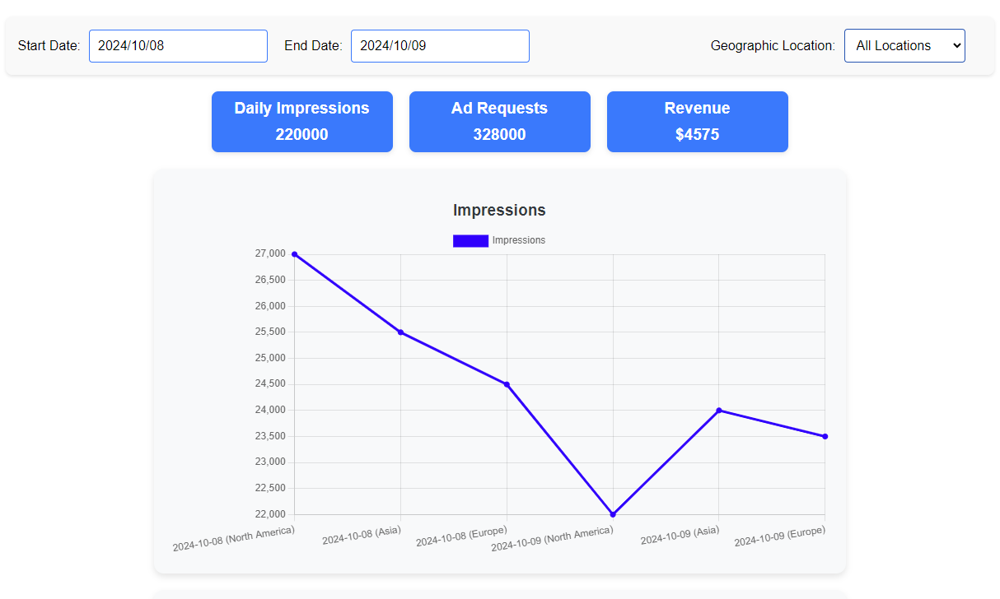

# Description

Developed a responsive dashboard component, behind a sign in/up page, using React.

In this project, I utilised Firebase to handle user authentication via email and password. Firebase provides a secure and efficient way to manage user sign-up, login, and session handling, allowing users to access the app with their credentials.

## Setting Up Firebase

To use Firebase authentication in your local environment, you will need to create a .env file with your Firebase project credentials. This file will not be included in the GitHub repository for security reasons, as it contains sensitive information.

- Begin by cloning the repository to your local machine.
- Create a Firebase Project
- Get Your Firebase Configuration: In your Firebase project settings, you will find your project's configuration. This includes details like API key, Auth domain, Project ID, etc.
- Create a .env file

## Example of .env file

REACT_APP_FIREBASE_API_KEY=YOUR_FIREBASE_API_KEY
REACT_APP_FIREBASE_AUTH_DOMAIN=YOUR_AUTH_DOMAIN
REACT_APP_FIREBASE_PROJECT_ID=YOUR_PROJECT_ID
REACT_APP_FIREBASE_STORAGE_BUCKET=YOUR_STORAGE_BUCKET
REACT_APP_FIREBASE_MESSAGING_SENDER_ID=YOUR_MESSAGING_SENDER_ID
REACT_APP_FIREBASE_APP_ID=YOUR_APP_ID
REACT_APP_FIREBASE_MEASUREMENT_ID=YOUR_MEASUREMENT_ID

## Future Developments

- Use Tailwind
- Add more properties for filtering
- Enhance the design

## Technologies and Tools Used

- React.js
- JavaScript
- TypeScript
- Jest
- json-server

## Prerequisites

- Node.js installed on your machine
- yarn install

## Installation

- Clone the repository to your local machine.
- Navigate to the project directory: cd Dashboard

## Available Scripts

You must run both `yarn start` and `npx json-server --watch db.json --port 5000`

- to run the json-server `npx json-server --watch db.json --port 5000`

- `yarn start`

- `yarn test`

## Test

- You could test by selecting 2024/10/08 as start date and 2024/10/09 as end date
  
